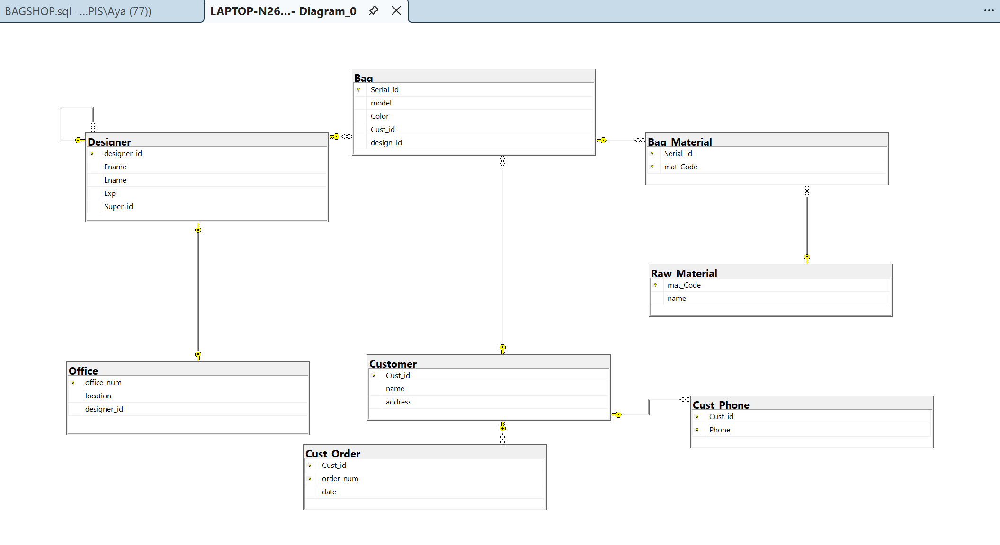

# Bags Store Database System (SQL Server)

## About the Project
A relational database management system for a bags store, created using Microsoft SQL Server (T-SQL). The project handles entities like designers, offices, customers, products, raw materials, and orders.

## Database Tables
* **Designer:** Manages employee details, experience years, and self-referencing supervisor relationships.
* **Office:** Stores office locations linked to specific designers.
* **Customer & Cust_Phone:** Stores customer personal info and multi-valued phone numbers.
* **Bag:** Manages bag models, colors, assigned customers, and designers.
* **Raw_Material & Bag_Material:** Tracks raw materials and handles the many-to-many relationship with bags.
* **Cust_Order:** Tracks customer orders and purchase dates.

## Database Diagram (ERD)

## Tech Stack
* Microsoft SQL Server (SSMS)
* T-SQL (DDL, DML, Joins, Aggregations, Subqueries)
